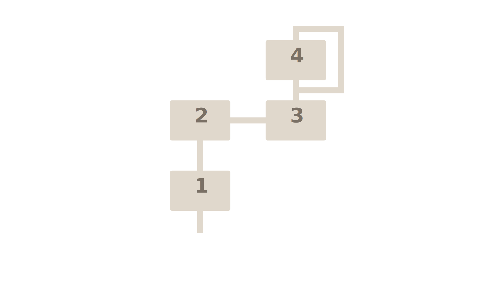
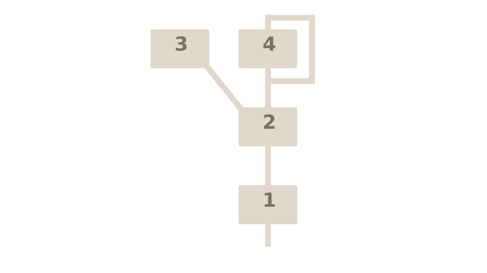
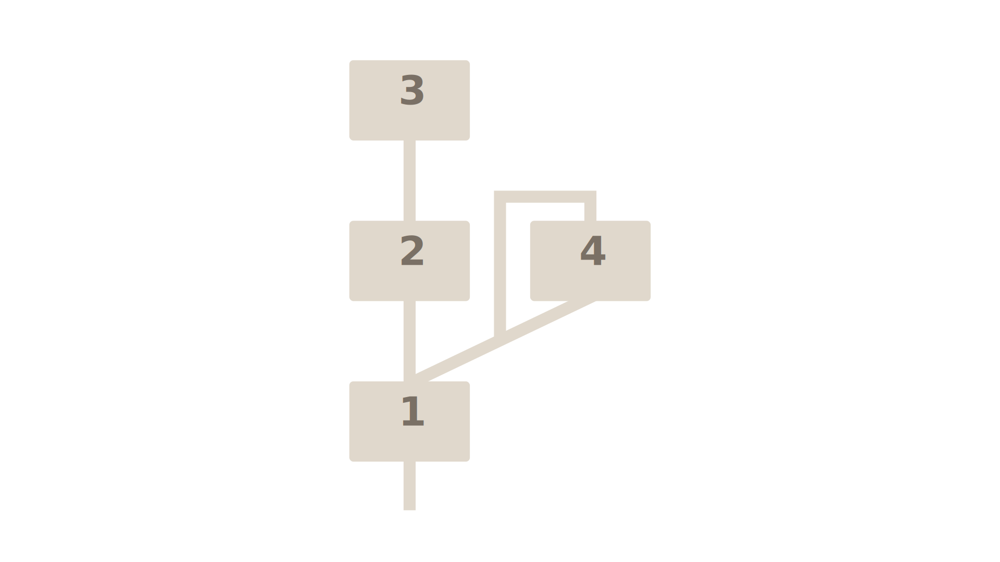
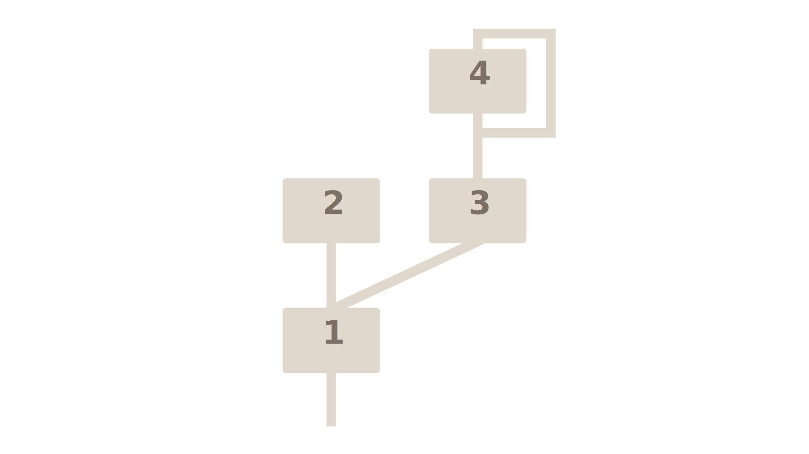
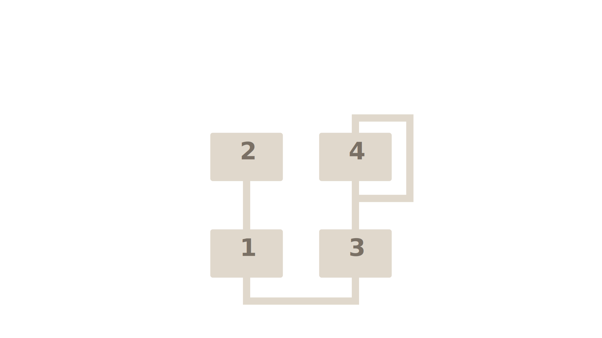
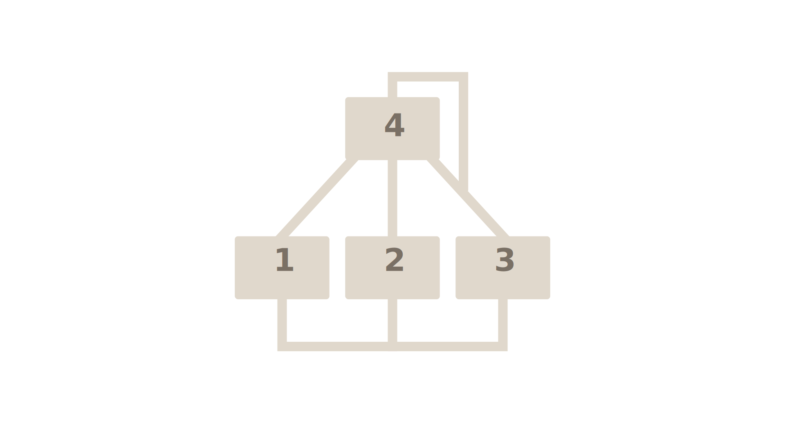
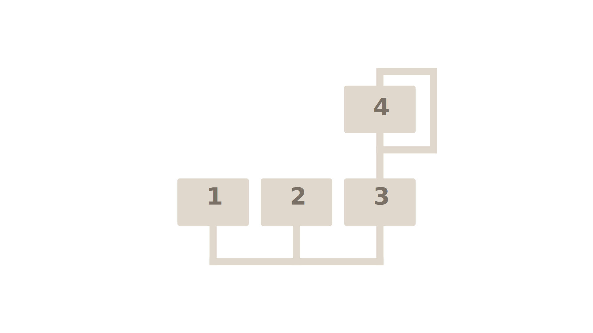
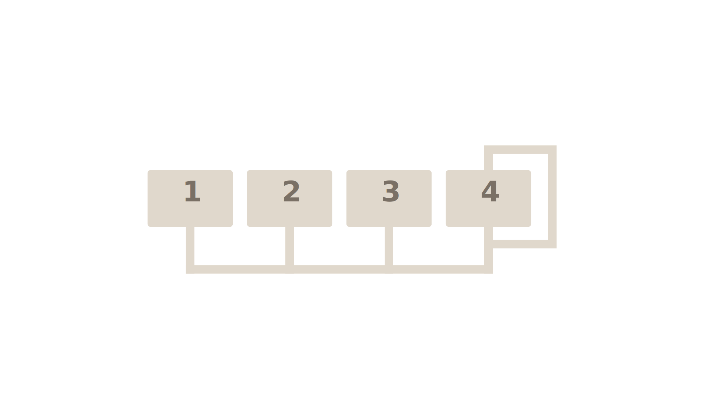

# XCent User Manual

**Version 0.14.0-rc1** — May 2026

---

## Table of Contents

1. [Introduction](#introduction)
2. [Requirements & Installation](#requirements--installation)
3. [Interface Overview](#interface-overview)
4. [PLAY Mode](#play-mode)
5. [EDIT Mode](#edit-mode)
6. [FUNC Mode](#func-mode)
7. [SCOPE](#scope)
8. [Patch Management](#patch-management)
9. [MIDI](#midi)
10. [Settings](#settings)
11. [FM Sound Design](#fm-sound-design)
12. [Appendix](#appendix)

---

## Introduction

XCent is a circuit-faithful emulation of the Yamaha DX100 — a four-operator FM synthesizer built around Yamaha's YM2164 OPP chip. It runs the actual DX100 ROM firmware on an HD6303 CPU emulator for 100% accurate voice allocation and parameter handling. The FM engine operates at the chip's native 55,930 Hz sample rate, resamples to your host's rate, and emulates the hardware's DAC quantization, aliasing characteristics, and reconstruction filter behavior.

XCent ships with the 192 factory voices from the original DX100 ROM, organized into four read-only ROM banks (100, 200, 300, 400) of 24 voices each. Four writable RAM banks (A, B, C, D) are available for your own patches. All eight FM algorithms are supported, with full four-operator control and OP4 self-feedback.

The interface provides three operating modes matching the DX100 hardware:

- **PLAY** — Browse and load patches
- **EDIT** — Edit voice parameters (Classic button grid or Modern knob/slider view)
- **FUNC** — Global settings (Master Tune, MIDI channel, portamento, etc.)

This manual covers XCent-specific operation: installation, the interface, patch management, MIDI, and preferences. **FM synthesis theory and sound design technique are not covered here.** The DX100 and XCent share the same synthesis engine, and the [Yamaha DX100 Owner's Manual](https://www.manualslib.com/manual/53959/Yamaha-Dx100.html) is the authoritative reference for those topics.

---

## Requirements & Installation

### System Requirements

| | |
|---|---|
| **Platforms** | Windows 10+, macOS 11+, iOS/iPadOS 16+, Linux (x86-64) |
| **Formats** | VST3, CLAP, Standalone (desktop); AUv3, Standalone (iOS/iPadOS) |
| **CPU** | Any modern x86-64 processor (desktop) or Apple Silicon/A-series (iOS). The DSP runs at native hardware rate (55,930 Hz) — allow for that in dense sessions. |
| **RAM** | Minimal. Factory library is ROM-sourced and loaded on first use. |

### Installation

**Windows (recommended — installer):**

Download `XCent-Setup-0.14.0-rc1.exe` and run it. The installer:
- Places VST3, CLAP, and Standalone in their standard system folders automatically
- Installs the Microsoft Edge WebView2 runtime if it isn't already present
- Adds an entry to Add/Remove Programs for clean uninstallation
- Clears any stale WebView2 cache from previous installs

**Windows (manual):**
```powershell
# VST3 — copy the entire XCent.vst3 folder
Copy-Item "XCent.vst3" -Destination "$env:ProgramFiles\Common Files\VST3" -Recurse

# CLAP
Copy-Item "XCent.clap" -Destination "$env:ProgramFiles\Common Files\CLAP"
```

If you install manually, you may need to install the [Microsoft Edge WebView2 runtime](https://developer.microsoft.com/microsoft-edge/webview2/) separately.

**macOS:**
```bash
# VST3
cp -r "XCent.vst3" ~/Library/Audio/Plug-Ins/VST3/

# CLAP
cp "XCent.clap" ~/Library/Audio/Plug-Ins/CLAP/

# AU (if included)
cp -r "XCent.component" ~/Library/Audio/Plug-Ins/Components/
```

**Linux:**
```bash
# VST3
cp -r "XCent.vst3" ~/.vst3/

# CLAP
cp "XCent.clap" ~/.clap/
```

**iOS/iPadOS:** Install via the App Store or TestFlight (beta).

### User Data Location

After installation, XCent's factory library and preferences are stored in:

- **Windows:** `Documents\KnivesOnStrings\XCent`
- **macOS:** `~/Library/Application Support/Knives On Strings/XCent`
- **Linux:** `~/.config/KnivesOnStrings/XCent`

The library folder location is configurable via Settings.

---

## Interface Overview

XCent's window is divided into four main areas: **Top Bar**, **Left Panel**, **Center Panel**, and **Patch Browser/Parameter Grid** (right panel).

### First-run tour

The first time you open XCent, an onboarding tour starts automatically a moment after the UI finishes loading. A spotlight overlay walks through nine steps — Modes, Operators, parameter editing, Modern view, Func mode, and the Patch browser. Each step has a **Skip** button if you want to jump straight in, and a **Next →** button to advance.

The tour only runs once. To re-run it later (e.g., to refresh, or to show a colleague), open Settings → Appearance → Onboarding and click **Run interface tour again**.

### Tooltips

Hovering a parameter button (in Classic Edit, Func mode, or on a Modern view knob/slider) shows a tooltip after a 500 ms delay containing the full parameter name and value range — handy if a 3-letter abbreviation isn't immediately obvious. Tooltips can be disabled in Settings → Appearance → Input.

### Top Bar

From left to right:

| Control | Function |
|---------|----------|
| **XCent Logo** | Branding. Does not perform any action. |
| **◄ Patch name ►** | Displays the active patch name. Click to open patch browser. Arrows step through patches in the current bank. |
| **⚙ Settings** | Opens Settings modal (themes, MIDI channel, audio device, user patches folder). |
| **? About** | Opens About modal with version info and links. |
| **🎹 Keyboard** | Toggles on-screen keyboard (49 keys, C2–C6). |
| **SCOPE** | Opens the XCent Scope window — a floating 3D waterfall display of the current patch's waveform. Button glows accent colour when the scope is open. See the [SCOPE](#scope) section. |
| **CPU** | Real-time CPU load meter for this instance. |
| **VU** | Output level meter (8-segment LED). |
| **OUTPUT** | Master output level knob. Double-click to reset to unity (0 dB). |

### Left Panel

The left panel mirrors the DX100 hardware layout:

| Control | Function |
|---------|----------|
| **LCD Display** | 16-character dot-matrix display showing current mode, patch name, and parameter values during editing. Available in Teal (authentic) or OLED Blue styles. |
| **PLAY / EDIT / FUNC** | Mode selector buttons. Active mode is lit. |
| **OP1–OP4** | (EDIT mode only) Selects which operator's parameters are shown. Each button has an indicator dot; the lit one is active. |
| **Bank buttons** | (PLAY mode only) Two rows of four LEDs: top row selects ROM banks (100, 200, 300, 400); bottom row selects RAM banks (A, B, C, D). Press PLAY again to toggle between ROM and RAM bank groups. |
| **INC / DEC** | Increment/decrement the selected parameter. Hold for continuous stepping. |
| **Data Knob** | Rotary data entry for the selected parameter (equivalent to INC/DEC but continuous). |

### Center Panel

Read-only information about the active patch:

| Display | Function |
|---------|----------|
| **Algorithm Diagram** | Visual representation of operator routing. Shows carriers and modulators and how they connect. Click the dropdown to select algorithms 1–8 directly. |
| **Envelope Display** | Graphical representation of the active operator's ADSR envelope (AR, D1R, D1L, D2R, RR). Updates in real time as you edit. |

### Patch Browser / Parameter Grid (Right Panel)

**In PLAY mode:** Shows the patch browser (6×4 grid, 24 slots per bank). Click any slot to load that patch immediately. The active patch is highlighted.

**In EDIT mode:** Shows either:
- **Classic Edit** — 4×6 button grid matching DX100 hardware layout
- **Modern view** — Graphical knobs and sliders (toggle via second press of EDIT button; green indicator shows Modern view is active)

---

## PLAY Mode

PLAY is the default mode. Browse and load patches; no parameters are editable here.

The LCD displays the current patch number and name (e.g., `101: IVORYEBONY`).

### Navigating Banks

XCent organizes patches into two groups of banks. Use the bank buttons on the left panel or the patch browser to select the active bank:

**ROM banks (read-only — original DX100 factory voices):**

| Button | Bank | Voices |
|--------|------|--------|
| **100** | Bank 100 | Patches 101–124 |
| **200** | Bank 200 | Patches 201–224 |
| **300** | Bank 300 | Patches 301–324 |
| **400** | Bank 400 | Patches 401–424 |

**RAM banks (writable — your own patches):**

| Button | Bank | Voices |
|--------|------|--------|
| **A** | Bank A | Patches A 1–A24 |
| **B** | Bank B | Patches B 1–B24 |
| **C** | Bank C | Patches C 1–C24 |
| **D** | Bank D | Patches D 1–D24 |

Press **PLAY** again while already in PLAY mode to toggle between the ROM bank group and the RAM bank group.

### Selecting a Patch

- Click any slot in the browser grid
- Use ◄ ► arrows in the top bar to step through the current bank
- Use INC/DEC buttons to step through patches

### Favorites & Recents

Above the bank selector:

- **★ Favorites** — Shows all starred patches from any bank
- **🕐 Recents** — Shows the last 24 loaded patches

Click the star icon on any patch to toggle its favorite status.

---

## EDIT Mode

EDIT mode exposes all voice parameters. Two views are available:

1. **Classic Edit** — Button grid matching DX100 hardware (default)
2. **Modern view** — Graphical knobs and sliders (press EDIT again to toggle; green indicator shows Modern view is active). To make Modern view the default when entering EDIT mode, enable **Default to Modern view** in Settings → Appearance → Input.

Both views modify the same parameters. The active operator (OP1–OP4) is selected via the left panel buttons.

> **Note:** Edits modify a working copy of the patch. Use **Save** in the patch browser to commit changes. Unsaved edits survive mode switches but are lost if you load a different patch without saving. A red indicator in the top bar shows when the edit buffer is dirty (has unsaved changes).

### Data Entry

All parameters support these interactions:

| Action | Function |
|--------|----------|
| **Click + Drag** | Drag up/down to change value. Faster than INC/DEC for large adjustments. |
| **Shift + Drag** | Fine adjustment. Slower drag for precise changes. |
| **Double-click** | Resets parameter to its value from the loaded patch (not init default). This is the "load point" — the state when the patch was last loaded. |
| **Right-click** | (Operator parameters only) Copy menu — copy current operator's value (or all parameters) to other operators. |
| **INC / DEC** | Increment/decrement by one step. Hold for continuous stepping. |
| **Data Knob** | Continuous rotary entry for selected parameter. |

### Classic Edit

Parameter grid layout (6 columns × 4 rows):

| Row | Col 1 | Col 2 | Col 3 | Col 4 | Col 5 | Col 6 |
|-----|-------|-------|-------|-------|-------|-------|
| **1** | ALG | FBL | FREQ | DET | OUT | AMS ON |
| **2** | AR | D1R | D1L | D2R | RR | KEY VEL |
| **3** | LW | LFS | LFD | SYNC | PMD | AMD |
| **4** | LS | RS | EBS | PMS | AMS | XPOSE |

For full parameter descriptions, see the [Modern view](#modern-view) section below or the [Yamaha DX100 Owner's Manual](https://www.manualslib.com/manual/53959/Yamaha-Dx100.html). Hovering any parameter button shows a tooltip with the full parameter name and value range (toggleable in Settings → Appearance → Input).

### Modern view

Press EDIT twice to enter Modern view (green indicator on EDIT button confirms active). The parameter area is divided into three sections: Operator, LFO, and Patch.

#### Operator Section (OP1–OP4)

Select the active operator using the OP1–OP4 buttons on the left panel. Each operator has independent parameters:

**Envelope (5 sliders):**

| Control | Parameter | Range | Description |
|---------|-----------|-------|-------------|
| **AR** | Attack Rate | 0–31 | How quickly envelope rises from zero to peak after note-on. 31 = instant, 0 = slowest. |
| **D1R** | Decay 1 Rate | 0–31 | How quickly level falls from peak to D1L sustain. 31 = instant, 0 = no decay. |
| **D1L** | Decay 1 Level | 0–15 | Sustain level after initial decay. **0 = maximum sustain, 15 = decay to silence.** |
| **D2R** | Decay 2 Rate | 0–31 | Second, slower decay during sustain phase. Useful for sounds that die away while held. 0 = disabled. |
| **RR** | Release Rate | 0–15 | How quickly envelope falls to zero after note-off. 15 = instant, 0 = slowest. |

**Frequency & Level (3 knobs):**

| Control | Parameter | Range | Description |
|---------|-----------|-------|-------------|
| **FREQ** | Frequency | 0.5–31 | Operator frequency as multiple of played note. 1 = unison, 2 = octave up, 0.5 = octave down. Non-integer values create inharmonic, bell-like or metallic tones. Primary timbre control. |
| **DETUNE** | Fine Detuning | -3 to +3 | Shifts operator slightly sharp or flat. Subtle detuning between operators adds richness and movement. Center = no detune. |
| **LEVEL** | Output Level | 0–99 | For **carriers**: volume contribution. For **modulators**: modulation depth (higher = brighter/more complex timbres). |

**Key Scaling & Modulation (3 knobs):**

| Control | Parameter | Range | Description |
|---------|-----------|-------|-------------|
| **L.SCL** | Left Key Scaling | 0–99 | Level change for notes below the scaling breakpoint. Positive = increase level toward bass, negative = decrease. |
| **R.SCL** | Right Key Scaling | 0–99 | Level change for notes above the scaling breakpoint. Commonly used to reduce harshness in upper register. |
| **EG.BS** | EG Bias Sensitivity | 0–7 | How strongly breath controller (CC2) modulates this operator's envelope. 0 = no effect. |

**Switches (2 toggles):**

| Control | Parameter | Description |
|---------|-----------|-------------|
| **AME** | Amplitude Mod Enable | When ON, LFO amplitude modulation affects this operator (governed by A.DEP in Patch section). |
| **KVS** | Key Velocity Sensitivity | When ON, harder keypresses increase operator level. OFF = full level regardless of velocity. |

#### LFO Section

Voice-global LFO parameters (shared by all four operators):

| Control | Parameter | Range | Description |
|---------|-----------|-------|-------------|
| **Waveform** | LFO Shape | 4 choices | **Triangle** (smooth vibrato/tremolo), **Sawtooth** (sweep), **Square** (trill), **S&H** (random stepped). |
| **SPEED** | LFO Rate | 0–99 | How fast the LFO cycles. Low = slow modulation, high = fast tremolo/vibrato. |
| **DELAY** | LFO Delay | 0–99 | Time after note-on before LFO begins. 0 = immediate, higher = delayed fade-in. |

#### Patch Section

Voice-global parameters (apply to entire patch):

**Structure (2 knobs):**

| Control | Parameter | Range | Description |
|---------|-----------|-------|-------------|
| **ALG** | Algorithm | 1–8 | Operator routing configuration. Determines carriers vs modulators. See [Algorithm Reference](#algorithm-reference). |
| **FBL** | Feedback Level | 0–7 | OP4 self-feedback. 0 = none, higher = buzzy/noisy/chaotic tones. DX100 only feeds back OP4. |

**LFO Modulation (3 knobs + 1 toggle):**

| Control | Parameter | Range | Description |
|---------|-----------|-------|-------------|
| **P.DEP** | Pitch Mod Depth | 0–99 | LFO pitch modulation amount (vibrato width). Works with P.SNS and mod wheel. |
| **A.DEP** | Amp Mod Depth | 0–99 | LFO amplitude modulation amount (tremolo) for operators with AME enabled. |
| **P.SNS** | Pitch Mod Sensitivity | 0–7 | Scales P.DEP's effect. Master sensitivity for pitch LFO. |
| **SYNC** | LFO Key Sync | ON/OFF | When ON, LFO resets phase on every note-on for consistent attack. |

**Tuning & Performance (6 knobs + 2 toggles):**

| Control | Parameter | Range | Description |
|---------|-----------|-------|-------------|
| **XPOSE** | Transpose | -24 to +24 | Shifts entire voice in semitones. Stored per-patch. |
| **POLY** | Polyphony | ON/OFF | ON = polyphonic (8 voices), OFF = monophonic (latest note cuts earlier). |
| **PORT** | Portamento | ON/OFF | Enables pitch glide between notes. Speed set by P.TIME. |
| **P.TIME** | Portamento Time | 0–99 | Glide speed when portamento active. Higher = slower. |
| **P.BEND** | Pitch Bend Range | 0–12 | Max pitch deviation in semitones at full pitch wheel deflection. |

**Controller Routing (6 knobs):**

| Control | Parameter | Range | Description |
|---------|-----------|-------|-------------|
| **MW.P** | Mod Wheel → Pitch | 0–99 | How much mod wheel (CC1) adds to vibrato (P.DEP). |
| **MW.A** | Mod Wheel → Amplitude | 0–99 | How much mod wheel adds to tremolo (A.DEP). |
| **BC.P** | Breath → Pitch | 0–99 | Breath controller (CC2) pitch modulation sensitivity. |
| **BC.A** | Breath → Amplitude | 0–99 | Breath controller amplitude sensitivity (expression). |
| **BC.PB** | Breath → Pitch Bias | 0–99 | Breath pressure applies DC offset to pitch (upward bend), not LFO modulation. |
| **BC.EB** | Breath → EG Bias | 0–99 | Breath raises operator levels for operators with EG.BS > 0 (brightness/attack). |

---

## FUNC Mode

FUNC mode contains global performance and MIDI settings. These are **not stored per-patch** — they apply to the entire XCent instance.

| Parameter | Description |
|-----------|-------------|
| **M.TUNE** | Master Tune — fine-tunes entire instrument (±50 cents). Useful when matching hardware at non-concert pitch. |
| **POLY/MONO** | Global polyphonic/monophonic mode (can also be set per-patch in EDIT). |
| **PORT MODE** | Portamento mode: **Full-time** (always glide) or **Fingered** (glide only on legato). |
| **PORT TIME** | Global portamento glide speed (can also be set per-patch in EDIT). |
| **P.BEND** | Global pitch bend range in semitones (can also be set per-patch in EDIT). |
| **MW PITCH** | Global mod wheel pitch modulation sensitivity. |
| **MW AMPLITUDE** | Global mod wheel amplitude modulation sensitivity. |
| **BC PITCH** | Global breath controller pitch sensitivity. |
| **BC AMPLITUDE** | Global breath controller amplitude sensitivity. |
| **BC PITCH BIAS** | Global breath controller pitch bias. |
| **BC EG BIAS** | Global breath controller EG bias. |

---

## SCOPE

The **SCOPE** button in the top bar opens the XCent Scope — a floating window that displays the current patch's waveform as an animated 3D waterfall. Play any note and watch the harmonics reshape in real time; tweak parameters and see the results immediately.

### Live Mode

Click **SCOPE** in the top bar to open the window. Play any note on the keyboard — the most recent voice's pre-filter output scrolls into the waterfall. Older frames fade toward the back of the stack. The frontmost (brightest) trace is the current cycle; older frames fade as they recede.

Controls at the bottom of the scope window:

| Control | Description |
|---------|-------------|
| **Trigger** | `Note On` (default) emits one frame per note trigger. `Continuous` emits frames at the display refresh rate regardless of triggers. |
| **Cycles** | How many frames stack in the waterfall: 8 / 16 / 32 / 64. Smaller values give a larger, bolder front-most frame. |
| **Freeze** | Pauses the waterfall scroll. New frames are ignored until you unfreeze. |
| **Export…** | Disabled for now — wavetable export arrives in a future update. |

**Mouse gestures on the canvas:**

| Gesture | Action |
|---------|--------|
| Click + drag horizontally | Rotate the waterfall yaw ±30°. |
| Click + drag vertically | Adjust amplitude zoom (0.5× – 4×). |
| Scroll wheel | Adjust perspective depth. |
| Double-click | Reset view. |

### Themes

Choose the trace colour in **Settings → Appearance → XCENT SCOPE**:

| Theme | When to use |
|-------|-------------|
| Classic Cyan (default) | Maximum contrast against XCent's dark skin. |
| XCent Amber | Matches XCent's LCD and OP-select LEDs. |
| OLED Blue | High-contrast on dim displays. |
| Light Mode | Pair with XCent's Light skin; inverts the fade direction. |

Theme changes apply immediately to an open scope window and persist across plugin sessions.

### Window

- Minimum 500 × 360 pixels; default 720 × 500; resizable.
- Position and size persist across plugin sessions.
- On iOS, Scope opens as a fullscreen sheet (coming in a future update).

### Render Mode

Click the **RENDER** tab to synthesise a wavetable from the current patch. The render runs on a background thread (~100–250 ms for a 256-frame capture) and drops the result into the waterfall display.

Controls:

| Control | Description |
|---|---|
| **Mode** | `Single-cycle` (one steady-state frame), `Envelope Morph` (N frames across an attack→decay window), or `LFO Sweep` (N frames across one LFO period). |
| **Note** | MIDI note the renderer simulates (default C4). Lower notes produce longer fundamental periods — useful for audibly-bassy wavetables. |
| **Vel** | Velocity 1–127 (default 100). Affects KVS-sensitive operators. |
| **Frames** | Number of frames in the output: 16 / 32 / 64 / 128 / 256 / 512. More frames = smoother morph, more CPU. |
| **Length** | Duration of the render window in seconds (0.1–8.0). Single-cycle ignores this. |
| **Render** | Starts the offline render. While running, the button reads "Rendering…" and a fade-in overlay sits over the waterfall. |

The rendered wavetable is stable — it doesn't scroll. Use the same mouse gestures (drag, wheel, double-click) to inspect it.

Switching between **LIVE** and **RENDER** tabs preserves both buffers: the live scope keeps its rolling frames while the render tab holds the last completed render.

### Wavetable export

Coming in a future update — the **Export…** button on the Render tab will save the rendered wavetable as Serum `.wav` (with `ClmS` + `uhWT` chunks), Vital `.vital`, Surge `.wt`, or plain WAV for u-he Zebra / Hive / generic wavetable consumers.

---

## Patch Management

### Banks

XCent has two types of banks:

- **ROM banks (100, 200, 300, 400):** 96 original DX100 factory voices, read-only. These match the hardware's factory ROM exactly. Patch slots are numbered in the DX100 style: bank 100 contains patches 101–124, bank 200 contains 201–224, and so on.

- **RAM banks (A, B, C, D):** 96 writable slots for your own patches (24 per bank). Patch slots are displayed as A 1–A24, B 1–B24, etc. RAM bank contents are automatically saved to disk when changed.

### Saving a Patch

After editing:

1. Click **SAVE** button in the patch browser (or right-click a slot → **Save here**)
2. Select a destination RAM bank (A–D) and slot
3. Enter a patch name (10 characters max, DX100 compatible)
4. Click **Save**

ROM banks are read-only and cannot be overwritten. The red "dirty" indicator in the top bar disappears when changes are saved.

### Favorites & Recents

- **★ Favorites** — Click the star icon on any patch to add it to Favorites. Access via PLAY mode → Favorites view.
- **🕐 Recents** — Automatically tracks the last 24 loaded patches. Access via PLAY mode → Recents view.

### Drag and Drop

Patches can be reordered within a bank and moved between banks:

- **Move:** Click and drag from one slot to another
- **Copy:** Hold Shift while dragging
- **Swap:** Drag occupied slot onto another occupied slot

Dragging to a ROM bank slot is not permitted.

### Rename & Delete

Right-click any patch slot in a RAM bank:

- **Rename** — Change patch name (10 chars max)
- **Delete** — Clear slot (confirmation required)
- **Initialize** — Reset slot to init patch (all parameters to default)

### SysEx Import & Export

XCent is compatible with standard DX100 SysEx formats:

**Export:**
- **Single voice (VCED)** — Right-click patch → **Export SysEx** → saves as `.syx` file
- **Bank (VMEM)** — Right-click bank header → **Export Bank** → saves 32 voices as `.syx`

**Import:**
- Drag `.syx` file onto patch browser
- Or right-click → **Import SysEx** → select `.syx` file

Imported bank dumps load into the first RAM bank (A). Compatible with hardware DX100 units and librarians:
- Dexed
- DX Manager
- Patch Base
- MIDI Quest
- Any DX100/DX21/DX27 compatible editor

---

## MIDI

### MIDI Channel

**Plugin mode (VST3/CLAP):** Responds to the MIDI channel configured in your DAW's instrument routing.

**Standalone mode:** Select MIDI channel in **Settings → MIDI / Audio** tab:
- **Omni** — Responds to all channels
- **1–16** — Responds only to the selected channel

### Control Change (CC)

| CC | Function | Description |
|----|----------|-------------|
| **1** | Mod Wheel | Adds to pitch/amp modulation per MW.P and MW.A settings |
| **2** | Breath Controller | Modulates pitch/amp/EG bias per BC.P, BC.A, BC.PB, BC.EB settings |
| **4** | Foot Controller | Expression (amplitude) |
| **5** | Portamento Time | Real-time control of portamento speed |
| **64** | Sustain Pedal | Hold notes (standard sustain behavior) |
| **65** | Portamento On/Off | Toggle portamento without using front panel |

### Pitch Bend

Full-resolution 14-bit pitch bend. Range is set:
- **Per-patch:** P.BEND in EDIT mode (Patch section)
- **Globally:** P.BEND in FUNC mode

Default range is 2 semitones (±2). Maximum range is 12 semitones (±1 octave).

### Velocity

Velocity sensitivity is controlled **per-operator** via KVS (Key Velocity Sensitivity) in EDIT mode:

- **0** — No velocity sensitivity (operator always at full level)
- **1–7** — Increasing velocity response (7 = maximum dynamic range)

Each operator can have independent velocity sensitivity. This allows, for example:
- Carrier with KVS=0 for constant level
- Modulator with KVS=7 for velocity-sensitive brightness

### Program Change

Program Change messages (0–127) load patches from the active bank:

| Program | Patch |
|---------|-------|
| 0 | Slot 1 |
| 1 | Slot 2 |
| ... | ... |
| 23 | Slot 24 |

**Bank Select** (CC 0 / CC 32) switches banks before sending Program Change:

| Bank Select value | Bank |
|-------------------|------|
| 0 | 100 (ROM) |
| 1 | 200 (ROM) |
| 2 | 300 (ROM) |
| 3 | 400 (ROM) |
| 4 | A (RAM) |
| 5 | B (RAM) |
| 6 | C (RAM) |
| 7 | D (RAM) |

### Portamento

Two portamento modes (set via **PORT MODE** in FUNC mode):

1. **Full-time** — Glide always active between consecutive notes
2. **Fingered** — Glide only when notes overlap (legato playing)

Portamento time is controlled by:
- **PORT TIME** in FUNC mode (global)
- **P.TIME** in EDIT mode Patch section (per-patch)
- **CC 5** (real-time MIDI control)

### SysEx

XCent responds to and transmits standard DX100 SysEx messages over MIDI:

**Receive:**
- **VCED** (single voice dump) — Loads into edit buffer
- **VMEM** (32-voice bank dump) — Imports bank to RAM bank A

**Transmit:**
- **VCED** — Sends edit buffer on request from librarian
- **VMEM** — Sends current bank (32 voices) on request

SysEx exchange works bidirectionally with:
- Hardware DX100/DX21/DX27 units
- Software librarians (Dexed, DX Manager, etc.)
- Generic MIDI SysEx utilities

---

## Settings

Click the **⚙** icon in the top bar to open Settings. Three tabs:

### Sound

| Setting | Description |
|---------|-------------|
| **Engine Mode** | **Vintage** (authentic — includes YM3014 DAC + NJM072D analog filter) or **Modern** (clean — bypasses analog stage for alias-free FM). |
| **User Patches Folder** | Location where RAM banks are stored. Default: platform-specific (see [Installation](#user-data-location)). Click **Browse** to move it to a custom location (e.g., shared drive, project folder). |

### Appearance

| Setting | Options | Description |
|---------|---------|-------------|
| **Window Size** | 100%, 125%, 150%, 175%, 200% | Plugin window scale. 100% = 800×600 px. Does not affect audio. |
| **Skin** | Dark, Light | Global color theme. Applies to all UI elements. |
| **Matrix Display** | Teal, OLED Blue | LCD display color. **Teal** = authentic DX100 LCD green. **OLED Blue** = modern blue OLED aesthetic. |
| **XCENT SCOPE** | Classic Cyan, XCent Amber, OLED Blue, Light Mode | Trace colour for the floating scope window. Classic Cyan is the default. Changes apply immediately to an open scope window. |
| **Modified Indicator** | DX-style (e→E case flip), Standard (asterisk) | How the LCD signals an edited patch with unsaved changes. |
| **Mouse wheel edits parameters** | On / Off | Enables scroll-wheel adjustment of Modern view knobs and sliders. Hold Ctrl for coarse, Shift for fine. Disable if your trackpad accidentally grabs controls. |
| **Show tooltips on hover** | On / Off | Shows the full parameter name and value range when you hover an Edit/Func grid button or a Modern view knob. 500 ms delay to avoid flashing during quick mouse passes. |
| **Default to Modern view** | On / Off | When EDIT mode is entered, automatically switch to Modern view rather than the Classic button grid. |
| **Run interface tour again** | (button) | Re-runs the first-run onboarding spotlight tour. See [First-run tour](#first-run-tour). |

### MIDI / Audio

| Setting | Description |
|---------|-------------|
| **MIDI Receive Channel** | **Omni** (all channels) or **1–16** (specific channel). Plugin mode: use DAW routing. Standalone only. |
| **Audio Device** | *(Standalone only)* Output device selection + sample rate. |
| **MIDI Input** | *(Standalone only)* MIDI input device selection. Shows all available MIDI ports. |

Settings are saved automatically and persist across sessions.

---

## FM Sound Design

XCent uses the same four-operator FM synthesis engine as the Yamaha DX100. Every parameter works identically to the hardware. If you know how to program a DX100, you know how to program XCent.

The [Yamaha DX100 Owner's Manual](https://www.manualslib.com/manual/53959/Yamaha-Dx100.html) is a thorough resource for FM synthesis theory and sound design technique. It applies directly to XCent.

### XCent-Specific Features

XCent adds modern conveniences not available on the hardware:

- **Undo/redo** — Available via Ctrl+Z / Ctrl+Y (or Cmd+Z / Cmd+Shift+Z on macOS). Explore freely without fear.
- **Visual Edit view** — All parameters accessible simultaneously without sequential button navigation.
- **Algorithm diagram** — Visual operator routing updates in real time as you change ALG.
- **Envelope display** — Envelope shape updates live as you edit stages.
- **Favorites & Recents** — Quick access to frequently-used patches.
- **On-screen keyboard** — 49-key (C2–C6) keyboard with pitch and mod wheels. Play from the plugin window without a MIDI controller.
- **Drag and drop** — Reorder patches within and between RAM banks.

### Authentic Hardware Behavior

XCent intentionally preserves the hardware's character:

**FM aliasing:** Native 55,930 Hz sample rate means sidebands fold back into the audible range. This is not a bug — it's the DX100 sound. Higher frequency ratios and feedback create brighter, noisier tones due to aliasing.

**DAC quantization:** YM3014 floating-point DAC (10-bit mantissa + 3-bit exponent) introduces subtle quantization artifacts at low levels. Audible as noise floor grain.

**Reconstruction filter:** NJM072D analog low-pass filter (-3 dB at ~10,600 Hz) with soft treble rolloff. Authentic DX100 warmth.

**Integer signal path:** All DSP computed at hardware bit widths (20-bit phase, 14-bit operators, 13-bit EG). No floating-point "cleaning" — bit-exact to the chip.

**To bypass these characteristics:** Set **Engine Mode** to **Modern** in Settings → Sound. This skips the analog output stage for clean, alias-free FM (still at 55,930 Hz native rate, but without DAC quantization or filter coloration).

---

## Appendix

### Algorithm Reference

XCent supports all eight DX100 FM algorithms. Each algorithm defines which operators are **carriers** (produce audible output) and which are **modulators** (shape carrier timbre).

#### Algorithm 1: Linear Stack


`OP1 → OP2 → OP3 → OP4 → OUT`

Four operators in series. Maximum modulation depth. Useful for complex, evolving timbres and aggressive, metallic sounds.

#### Algorithm 2: Three Modulators + Carrier


`OP1 → OP2 → OP3 → OP4 → OUT`  
(OP4 is the sole carrier)

Three modulators feeding one carrier. Extreme timbral complexity. Good for bells, gongs, and dense harmonic content.

#### Algorithm 3: Dual Stacks


`OP1 → OP2 → OUT`  
`OP3 → OP4 → OUT`

Two independent 2-operator chains. Useful for layered sounds: bass + lead, pad + pad, dual timbres.

#### Algorithm 4: Two Modulators + Two Carriers


`OP1 → OP2 → OUT`  
`OP3 → OUT`  
`OP4 → OUT`

One modulated carrier + two pure carriers. Good for adding brightness or octaves to a modulated tone.

#### Algorithm 5: Two Carriers, Two Chains


`OP1 → OP2 → OUT`  
`OP3 → OP4 → OUT`

Two independent carriers, each with one modulator. Balanced complexity. Versatile for pads, leads, basses.

#### Algorithm 6: Three Independent Carriers + One Modulator


`OP1 → OP2 → OUT`  
`OP3 → OUT`  
`OP4 → OUT`

One modulated carrier + two pure carriers. Similar to Alg 4 but different routing. Useful for adding harmonics.

#### Algorithm 7: Three Carriers + One Modulated Pair


`OP1 → OUT`  
`OP2 → OUT`  
`OP3 → OP4 → OUT`

Three independent carriers: two pure, one modulated. Good for organ-like tones, stacked harmonics.

#### Algorithm 8: Four Independent Carriers


`OP1 → OUT`  
`OP2 → OUT`  
`OP3 → OUT`  
`OP4 → OUT`

Four sine waves (no modulation). Pure additive synthesis. Useful for organs, simple waveforms, tuned percussion.

**Note:** OP4 self-feedback is available in all algorithms. Set FBL > 0 to add harmonics, noise, or chaotic character.

### Keyboard Shortcuts

| Action | Windows/Linux | macOS |
|--------|---------------|-------|
| **Undo** | Ctrl+Z | Cmd+Z |
| **Redo** | Ctrl+Y or Ctrl+Shift+Z | Cmd+Shift+Z |
| **Save Patch** | Ctrl+S | Cmd+S |
| **Open Patch Browser** | Ctrl+O | Cmd+O |
| **Toggle On-Screen Keyboard** | Ctrl+K | Cmd+K |
| **Next Patch** | → | → |
| **Previous Patch** | ← | ← |
| **Mode: PLAY** | F1 | F1 |
| **Mode: EDIT** | F2 | F2 |
| **Mode: FUNC** | F3 | F3 |

### Known Issues

See [`bugs.md`](https://github.com/Knives-On-Strings/xcent/blob/main/bugs.md) in the repository for current known issues and workarounds.

### Support

**Bug reports & feature requests:** [GitHub Issues](https://github.com/Knives-On-Strings/xcent/issues)

**General questions:** [knivesonstrings@gmail.com](mailto:knivesonstrings@gmail.com)

**Website:** [knivesonstrings.com/xcent](https://knivesonstrings.com/xcent)

**Source code:** [github.com/Knives-On-Strings/xcent](https://github.com/Knives-On-Strings/xcent)

### Trademarks & Attribution

**Yamaha** and **DX100** are trademarks of Yamaha Corporation. XCent is an independent emulation, not affiliated with or endorsed by Yamaha.

**ASIO** is a trademark and software of Steinberg Media Technologies GmbH. ASIO support is included in the Windows Standalone build to allow users to connect ASIO-compatible audio interfaces.

**VST** is a trademark of Steinberg Media Technologies GmbH.

**Apple**, **macOS**, **iOS**, **iPadOS**, and **Audio Units** (AU/AUv3) are trademarks of Apple Inc.

**Windows** is a trademark of Microsoft Corporation.

#### Open-Source Components

XCent's compiled binary statically links the following open-source libraries:

- **Nuked-OPP** — Cycle-accurate YM2164 (OPP) emulator. A modified fork of Nuke.YKT's Nuked-OPM with DX100-specific behavioural tweaks and renamed symbols. Original © 2020, 2026 Nuke.YKT; modifications © Knives On Strings. Licensed under the GNU Lesser General Public License version 2.1 (LGPL-2.1-or-later). Modified source available at the Knives On Strings public GitHub organization (URL in `NOTICES.txt`) and on request via [knivesonstrings@gmail.com](mailto:knivesonstrings@gmail.com).
- **JUCE 8** — Cross-platform audio plugin framework. © Raw Material Software Limited. Used under the JUCE 8 commercial license.
- **clap-juce-extensions** — CLAP format support for JUCE. © 2019–2020 Paul Walker. MIT License.
- **VST3 SDK** — © Steinberg Media Technologies GmbH. Used under MIT License (via JUCE).
- **React** + **React DOM** — © Meta Platforms. MIT License.
- **Zustand** — MIT License.
- **Tailwind CSS** — MIT License.
- **Inter** typeface by Rasmus Andersson — SIL Open Font License 1.1.

Acknowledged as an upstream reference but **not** linked into the shipped product:

- **Nuked-OPM** — Original YM2151 emulator by Nuke.YKT (LGPL-2.1-or-later). Used by the test suite as a verification baseline for Nuked-OPP.

Full license texts are included in the installer as `NOTICES.txt`.

---

**XCent User Manual v0.14.0-rc1** — May 2026  
© 2026 Knives On Strings. All rights reserved.

For the most up-to-date version of this manual, visit [knivesonstrings.com/xcent/manual](https://knivesonstrings.com/xcent/manual).
